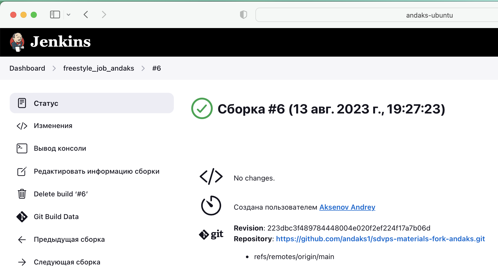
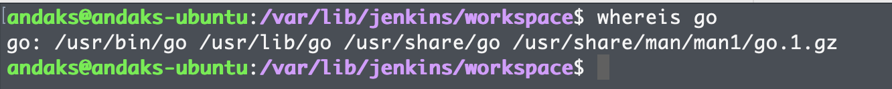
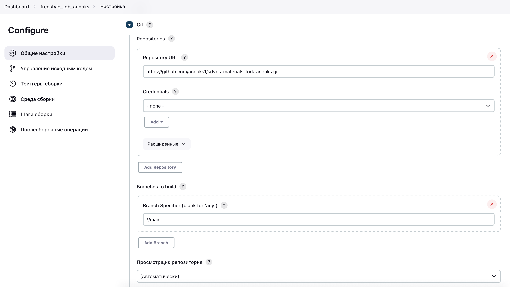
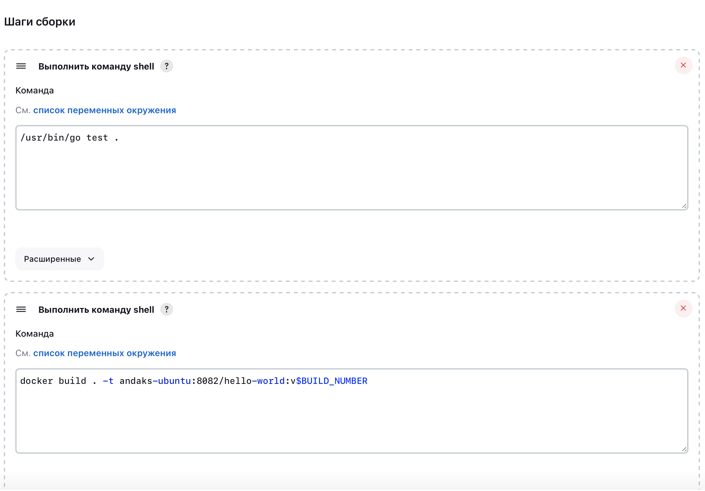

# Домашнее задание к занятию "`Что такое DevOps. СI/СD`" - `Андрей Аксенов`

### Инструкция по выполнению домашнего задания

Сделайте fork репозитория c шаблоном решения к себе в GitHub и переименуйте его по названию или номеру занятия, например, https://github.com/имя-вашего-репозитория/gitlab-hw или https://github.com/имя-вашего-репозитория/8-03-hw.
Выполните клонирование этого репозитория к себе на ПК с помощью команды git clone.
Выполните домашнее задание и заполните у себя локально этот файл README.md:
впишите сверху название занятия, ваши фамилию и имя;
в каждом задании добавьте решение в требуемом виде — текст, код, скриншоты, ссылка.
для корректного добавления скриншотов используйте инструкцию «Как вставить скриншот в шаблон с решением»;
при оформлении используйте возможности языка разметки md. Коротко об этом можно посмотреть в инструкции по MarkDown.
После завершения работы над домашним заданием сделайте коммит git commit -m "comment" и отправьте его на GitHub git push origin.
Для проверки домашнего задания в личном кабинете прикрепите и отправьте ссылку на решение в виде md-файла в вашем GitHub.
Любые вопросы по выполнению заданий задавайте в чате учебной группы или в разделе «Вопросы по заданию» в личном кабинете.
Желаем успехов в выполнении домашнего задания!

#### Задание 1

Что нужно сделать:

1. Установите себе jenkins по инструкции из лекции или любым другим способом из официальной документации. Использовать Docker в этом задании нежелательно.
2. Установите на машину с jenkins golang.
3. Используя свой аккаунт на GitHub, сделайте себе форк репозитория. В этом же репозитории находится дополнительный материал для выполнения ДЗ.
4. Создайте в jenkins Freestyle Project, подключите получившийся репозиторий к нему и произведите запуск тестов и сборку проекта go test . и  docker build ..
В качестве ответа пришлите скриншоты с настройками проекта и результатами выполнения сборки.

#### Ответ на задание 1.
1. Jenkins установлен 
2. golang установлен 
3. Fork выполнен
4. Настройки проекта , 

---
 
#### Задание 2

Что нужно сделать:

Создайте новый проект pipeline.
Перепишите сборку из задания 1 на declarative в виде кода.
В качестве ответа пришлите скриншоты с настройками проекта и результатами выполнения сборки.

#### Ответ на задание 2.

---

#### Задание 3

Что нужно сделать:

Установите на машину Nexus.
Создайте raw-hosted репозиторий.
Измените pipeline так, чтобы вместо Docker-образа собирался бинарный go-файл. Команду можно скопировать из Dockerfile.
Загрузите файл в репозиторий с помощью jenkins.
В качестве ответа пришлите скриншоты с настройками проекта и результатами выполнения сборки.

#### Ответ на задание 3

---

Дополнительные задания* (со звёздочкой)

Их выполнение необязательное и не влияет на получение зачёта по домашнему заданию. Можете их решить, если хотите лучше разобраться в материале.

Задание 4*

Придумайте способ версионировать приложение, чтобы каждый следующий запуск сборки присваивал имени файла новую версию. Таким образом, в репозитории Nexus будет храниться история релизов.

Подсказка: используйте переменную BUILD_NUMBER.

В качестве ответа пришлите скриншоты с настройками проекта и результатами выполнения сборки.
